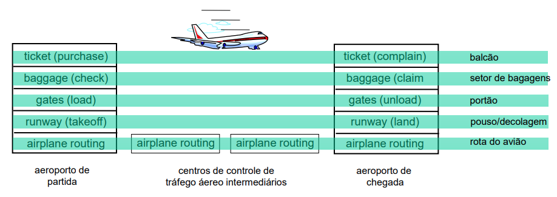

# PTC3360 - 2025

<!--PARTE 1-->
# Parte 1 - Redes de comunicação

Referência: (Kurose, Seções 1.1 e 1.2)

- Objetivo: Introduzir a terminologia e a infraestrutura das redes de comunicação atuais

- Abordagem: Usar a Internet como exemplo

- Visão geral:
    - O que é a Internet?
    - O que é um protocolo?
    - Borda da rede: hosts, acesso a rede, meio físico
    - Núcleo da rede: comutação por pacote e por circuito, estrutura da Internet

- Conceitos básicos
    - Elementos e estrutura de redes
    - Camadas de protocolos, modelos
de serviço

## O que é a Internet?
Há 2 formas de responder
- Conjunto hardware + software
- Infraestrutura de serviços

## A borda da rede
### Sistemas finais:
### Redes de acesso:
### Enlaces:

## Núcleo da rede
### Comutação de pacotes
### Comutação de circuitos
### Estrutura da rede

## Camadas de protocolos e modelos de serviços
Redes são complicadas e apresentam diversos elementos, como hosts, roteadores, enlaces de vários meios, aplicações, protocolos, ...

Existe alguma forma de organizar a estrutura da rede?

Usando viagem de avião como exemplo, podemos **dividir numa série de passos**.

Cada camada implementa um serviço
- via suas próprias ações internas à camada
- contando com serviços providos pela camada inferior

A divisão com camadas é importante para lidarmos com sistemas complicados
- Tem uma estrutura mais explícita para identificar as
relações entre as partes do sistema complicado
- A modularização facilita a manutenção e atualização do sistema

<!--PARTE 2-->
# Parte 2 - Camadas superiores

## Aplicação
...

## Transporte
...

## Rede
...

<!--PARTE 3-->
<!--PARTE 4-->
<!--PARTE 5-->