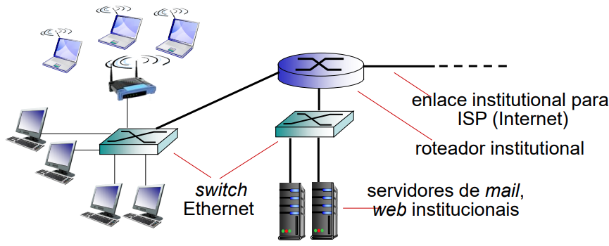

# Parte 1 - Redes de comunicação

Referência:
- Parte 1: Kurose, Seções 1.1 e 1.2
- Parte 2: Kurose, Seções 1.2 e 1.3
- Parte 3: Kurose, Seções 1.3 e 1.5

- Objetivo: Introduzir a terminologia e a infraestrutura das redes de comunicação atuais

- Abordagem: Usar a Internet como exemplo

- Visão geral:
    - O que é a Internet?
    - O que é um protocolo?
    - Borda da rede: hosts, acesso a rede, meio físico
    - Núcleo da rede: comutação por pacote e por circuito, estrutura da Internet

- Conceitos básicos
    - Elementos e estrutura de redes
    - Camadas de protocolos, modelos
de serviço

## O que é a Internet?
Há 2 formas de responder
- Conjunto hardware + software
- Infraestrutura de serviços

### Conjunto de hardware e software
O hardware é composto por:
- bilhoes de dispositivos conectados
- enlaces de comunicação (fibra ótica, cabos de cobre, rádio satélite, ...)
- comutadores de pacotes
- dispositivos de armazenamento: dados são distribuídos em diversas unidades de disco rígido e dispositivos SSD

> Como abordar um sistema tão complexo?
>>Dado que as redes de comunicação (Internet, por exemplo) são tão complexas, como estudar e entender seu funcionamento?   Vamos focar em princípios e estrutura básicos – fundamentos para entender as redes não só de hoje mas do futuro também.

> Sem perder de vista conceitos mais gerais, usar exemplos concretos vindos sobretudo da Internet.
>>**OBS.:** O uso de acrônimos é disseminado na área de redes (sopa de letras), como você perceberá nas próximas aulas. Mas você não precisa se preocupar em decorá-los.

O software é composto por:
- protocolos
    - formas de controlar o envio e recebimento de mensagens (ex.: TCP, IP, HTTP, 802.11, etc.)
- padrões Internet  
    - IETF (Internet Engineering Task Force)
        - RFC (Request for comments)
        - [Link](https://www.ietf.org/process/rfcs/)
    - IEEE
        - Camadas de enlace e física
        - Ex.: IEEE 802 Standards Committee -- Ethernet e Wifi
        - [Link do IEEE 802](http://www.ieee802.org/)

#### O que é um protocolo?

Exemplos de protocolos humanos: falar "alô" ao iniciar uma conversa no telefone, levantar a mãp em aula para fazer uma pergunta

Protocolos de rede: troque os humanos por máquinas

> Protocolos são padrões que definem formato e ordem das mensagens enviadas e recebidas entre entidades da rede e ações tomadas quanto à transmissão e recepção de mensagens

### Infraestrutura de serviços

- Infraestrutura que provê serviços a aplicativos (apps) que rodam em sistemas finais. 
    - Exemplos de apps: Web, VoIP, email, jogos, e-commerce, redes sociais, ...

- Provê interface de programação para apps (API)
    - Regras que permitem apps enviar e receber dados (mensagens).
    - Pode prover várias opções de serviço, de forma análoga às cartas em um serviço postal convencional.

Uma segunda olhada na estrutura da rede:
- Borda da rede:
    - Hosts: clientes e servidores
    - Servidores muitas vezes em data centers
    - Google – data centers com $10^5$ servidores
- Redes de acesso:
    - Redes que fisicamente conectam um host ao primeiro roteador (roteador de borda)
    - Enlaces cabeados ou sem fio
- Núcleo da rede:
    - ISPs interconectados
    - Rede de redes

## A borda da rede
### Sistemas finais
Hosts diferentes (IoT - *Internet of Things*)

### Redes de acesso
> Como conectar sistemas finais aos roteadores da borda?

1. Redes de acesso móvel
2. Redes de acesso residencial
3. Redes de acesso institucionais

Propriedades:
- Taxa de transmissão (bits por segundo) do acesso à rede.
- Compartilhado ou dedicado?

#### Redes de acesso móvel
> Cenário: Número de assinantes de telefonia celular com acesso a rede – [266 milhões de celulares no Brasil](https://www.teleco.com.br/mshare.asp) no 2º trimestre de 2025 para uma população de [203 milhões](https://censo2022.ibge.gov.br/panorama/).

Dois importantes desafios:
- Sem fio: comunicação sobre enlace sem fio
- Mobilidade: tratamento do usuário móvel que muda de ponto de conexão à rede
- Mais desafiante: ambos ao mesmo tempo – VoIP em um carro a 120 km/h

> Exemplo: rede de acesso móvel LTE (celular 4G)
Sistemas LTE usam uma rede de pacotes própria para conectar as estações rádio-base com os servidores (S-GW) e as interfaces externas (P-GW) do seu núcleo de rede

    

#### Redes de acesso residencial
> Exemplo: Digital Subscriber Line (DSL)

- Fornecido por companhia telefônica (Ex: Vivo)
- Usa linha telefônica existente até o DSLAM da central
- “3 enlaces” na mesma linha (multiplexação em frequência)
    - canal telefônico convencional bidirecional na faixa entre 0 e 4 kHz
    - canal upstream de média velocidade na faixa de 4 kHz a 140 kHz
    - canal downstream de alta velocidade na faixa de 140 kHz a 2,2 MHz 
- Na central:
    - dados sobre a linha telefônica DSL vão para a Internet
    - voz sobre a linha telefônica DSL vai para a rede telefônica
- Taxas de transmissão (assimétrico): https://en.wikipedia.org/wiki/G.992.5

- Inferior a:
    - 3 Mbps taxa de transmissão upstream (típico < 1 Mbps)
    - 24 Mbps taxa de transmissão downstream (típico < 10 Mbps)

> Exemplo: rede de TV a cabo

- Fornecido por empresa de TV a cabo (Ex: Virtua da Net)
- Multiplexação por divisão de frequência: canais diferentes transmitidos em bandas de frequência diferentes
- HFC: hybrid fiber coax
- Assimétrico: até 10 Gbps de taxa de transmissão downstream, 1 Gbps de taxa de transmissão upstream (DOCSIS 4 - https://en.wikipedia.org/wiki/DOCSIS)
- Residências partilham rede de acesso até headend da empresa;
diferente do DSL, que tem acesso dedicado até a central
    - necessário protocolo para endereçar e evitar colisões! (Veremos…)
    - cada pacote enviado ao headend chega a todos os usuários!
    - taxa disponível para cada usuário pode ser afetada pelo uso feito pelos outros

> Exemplo: rede doméstica

    

#### Redes de acesso institucional

    

- Tipicamente usadas em empresas, universidades, etc
- Taxas de transmissão de10 Mbps, 100 Mbps, 1 Gbps, 10 Gbps
- Atualmente, sistemas finais tipicamente conectam-se em switch Ethernet
- Veremos muito mais detalhes sobre roteadores, switches,
etc. em breve…

### Enlaces

#### Meio físico guiado

Os bits são transportados por ondas eletromagnéticas que se propagam do transmissor ao receptor

- Meio físico (enlace): por onde as ondas se propagam
    - Meio guiado: Ondas confinadas no espaço por meio sólido: cobre, fibra, cabo coaxial
    - Meio não guiado: Ondas não confinadas, propagando-se no ar

Exemplos de meios guiados:
1. Par trançado
    - dois fios de cobre isolados
        - Categoria 5: 100 Mbps, 1 Gpbs Ethernet
        - Categoria 6: 10 Gbps
    - LANs, DSL
2. Cabo coaxial
- Dois condutores de cobre concêntricos
- Banda larga:
    - Múltiplos canais no mesmo cabo
    - HFC – TV a Cabo

3. Cabo de fibra ótica
- fibra de vidro carregando pulsos de luz,
cada pulso transmite um símbolo
- operação de alta velocidade
    - Taxas de transmissão de até centenas
de Gb/s
- baixas taxas de erro
    - repetidores podem estar bem afastados; imunidade a ruido
- Equipamentos ainda são mais caros
    - usados principalmente no núcleo da rede

#### Meio físico não guiado

Ondas eletromagnéticas não confinadas.

Sujeitas aos efeitos do ambiente na porpagação: reflexão, obstrução por objetos e interferência

Exemplos de enlace não guiado:
- Redes locais (LAN) (WiFi, Bluetooth)
    - 11Mb/s, 54 Mb/s, etc.
- Área ampla (WAN) (e.g., celular)
    - Celular 3G, 4G, 5G: ~ alguns Mbps
- Satélite
    - Canais de kb/s até dezenas de Mb/s (ou múltiplos canais menores)
    - 270 ms de atraso fim a fim
    - Geossíncronos versus baixa altitude

## Núcleo da rede

Malha de trocadores de pacotes (roteadores) interconectados

### Comutação de pacotes
- Conjuntos de bits (pacotes) enviados a partir de um host com destino a outro host
- Os pacotes são enviados de um roteador ao próximo, através de enlaces no caminho entre fonte e destino
- Cada pacote é sempre transmitido usando a capacidade total do enlace

#### Duas funções chave do núcleo da rede

- Roteamento: determina a rota fonte-destino tomada pelos pacotes
    - algoritmos de roteamento
- Repasse: move pacotes de entrada do roteador para a saída apropriada

    

### Estrutura da rede
- Sistemas finais conectam-se à Internet via ISP (*Internet Service Provider*) de acesso, também conhecidas como Redes de Acesso.
    - ISPs residenciais, de empresas e universidades.
- ISPs de acesso por sua vez precisam ser interconectados.
    - Assim, quaisquer dois hosts podem enviar pacotes entre si.
- Rede de redes resultante é bem complicada!
    - Estrutura atual é resultado não só de decisões tecnológicas, mas também econômicas e políticas.
- Vamos usar uma abordagem passo-a-passo para descrever de forma bastante simplificada a estrutura atual da Internet

### Comutação de circuitos

## Camadas de protocolos e modelos de serviços
Redes são complicadas e apresentam diversos elementos, como hosts, roteadores, enlaces de vários meios, aplicações, protocolos, ...

Existe alguma forma de organizar a estrutura da rede?

Usando viagem de avião como exemplo, podemos **dividir numa série de passos**.

Cada camada implementa um serviço
- via suas próprias ações internas à camada
- contando com serviços providos pela camada inferior

A divisão com camadas é importante para lidarmos com sistemas complicados
- Tem uma estrutura mais explícita para identificar as
relações entre as partes do sistema complicado
- A modularização facilita a manutenção e atualização do sistema
    - Mudança de implementação do serviço numa camada é transparente para o resto do serviço
    - Ex.: mudar o procedimento de embarque e desembarque não afeta o resto do sistema

### Pilha de protocolos Internet

    

- Aplicação: contendo aplicativos de rede
que geram **mensagens**
    - HTTP, SMTP, DNS, [Signal Protocol](https://en.wikipedia.org/wiki/Signal_Protocol)
(usado no Whatsapp, por exemplo), [Apple Airplay](https://en.wikipedia.org/wiki/AirPlay), etc.
- Transporte: transferência de **segmentos**
aplicativo-aplicativo
    - TCP e UDP [QUIC](https://pt.wikipedia.org/wiki/QUIC)
- Rede: roteamento de **datagramas** da
fonte ao destino
    - IP, protocolos de roteamento
- Enlace: transferência de **quadros** entre
elementos vizinhos na rede
    - Ethernet, WiFi, DOCSIS
- Física: transmissão física dos **bits**;
depende do meio de transmissão

> OBS.: Os nomes em negrito se referem à palavra "pacote" em cada uma das camadas. Dependendo da camada, usaremos uma palavra diferente para nos referirmos a "pacote", i.e., aquilo que está sendo transmitido

