<!--PARTE 2-->
<!--
2. Introdução às camadas superiores (7 aulas)

2.3. Camada de rede: endereçamento IP e como funciona um roteador
-->
# Parte 2 - Camadas superiores

Referência:
- Aplicação: Kurose, Seções 2.1 e 2.2
- Transporte:
- Rede:

- Neste capítulo do curso, será feita uma introdução a aspectos das 3 camadas superiores da pilha de protocolos Internet (Aplicação, Transporte e Rede).
- A abordagem utilizada é a top-down, começando da camada de aplicação, mais próxima dos usuários, em direção à camada física.
- Esses assuntos são detalhados em cursos posteriores de graduação e pós-graduação.

## Aplicação
### Camada de aplicação
Alguns aplicativos de rede:
- E-mail
- Whatsapp
- Waze e Google Maps
- BitTorrent
- Jogos online
- Streaming de vídeo
- Videoconferência (Meet e Zoom)
- Redes socias
- Dentre outros...

#### Arquiteturas de aplicação
1. Cliente-servidor
    - Servidor:
        - em host sempre ligado
        - tem endereço IP permanente
        - podem estar em data centers, pensando em escala (servidor virtual)
    - Cliente:
        - comunicam-se com servidor e não diretamente entre si
        - podem se conectar de forma intermitente
        - podem ter endereços IP dinâmicos
    - Exemplos: Web, e-mail, streaming, ...

2. *Peer-to-peer* (P2P)
    - Dependência mínima de servidores dedicados
    - Comunicação direta ente sistemas finais (peers)
    - Peers requerem serviço de outros
    peers – provêm serviço para outros
    peers em retorno
        - Autoescalável – novos peers trazem
        novas demandas de serviço, mas
        também fornecem serviço
    - Peers conectam-se intermitentemente e mudam endereço IP
        - Gerenciamento mais complexo
    - Exemplo: BitTorrent, Bitcoin, Bluetooth

#### Sockets

- Aplicativo envia/recebe mensagens de/para uma interface de software ([API -Application Programming Interface](https://en.wikipedia.org/wiki/API)) : socket
- Aplicativo transmissor envia mensagem pela porta
- Ele confia na infraestrutura de transporte do outro lado da porta para entregar mensagem ao socket no aplicativo receptor
- Aplicativo receptor lê dados do socket

    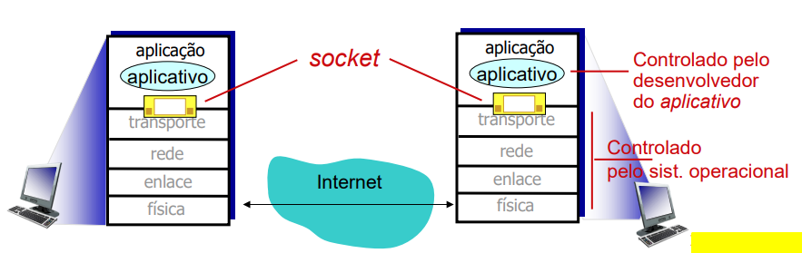

#### Endereçamento de processos

- Para receber mensagens, processo precisa ter identificador
- Dispositivo host tem endereço IP de 32 bits único (IPv4)
- Endereço IP do host em que o processo roda é suficiente para identificar o processo? $\rarr$ Não. Muitos processos podem estar rodando no mesmo host!

- Identificador inclui tanto endereço IP (32 bits) quanto número da porta associado com processo no host.
- Exemplos de números de porta:
    - Servidor web (HTTP): 80
    - Servidor web (HTTPS): 443
    - Servidor de e-mail (SMTP): 25
    - Gerenciados pela Internet Assigned Numbers Authority (IANA)
    - [iana.org](http://www.iana.org)
- Para enviar mensagem HTTP para servidor web [www.usp.br](http://www.usp.br/):
    - Endereço IP: 200.144.248.41
    - Número de porta: 80
- Mais em breve…

O protocolo da camada de aplicação define:
- Tipos de mensagens trocadas
    - Por exemplo, requisição, resposta
- Sintaxe da mensagem
    - Campos da mensagem e como eles são delineados
- Semântica das mensagens
    - Significado das informações dos campos
- Regras para quando e como aplicativos enviam e respondem mensagens

Protocolos abertos:
- Definidos em RFCs
- Permitem interoperabilidade
- Exemplos:
    - HTTP [[RFC 9110](https://www.rfc-editor.org/rfc/rfc9110)]
    - SMTP [[RFC 5321](https://tools.ietf.org/html/rfc5321)]

Protocolos proprietários:
    - Por exemplo, Microsoft Teams.

#### Exemplo de Aplicação: Web e HTTP 1.1

Primeiro, alguns conceitos básicos…
- Uma página web consiste de objetos (arquivos).
- Um objeto pode ser um arquivo HTML, uma imagem JPEG, um arquivo de áudio, um vídeo, etc.
- Uma página web consiste de “programa” HTML base que inclui diversos objetos referenciados.
- Cada objeto é endereçável por uma URL (Uniform Resource Locator), por exemplo:

    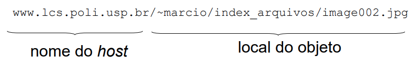

#### Visão geral do HTTP

Sigla para HyperText Transfer Protocol

- HTTP 1.0 (RFC 1945 - 1996)
- HTTP 1.1 (RFC 2068 –1997)
- HTTP/2 (RFC 7540 - 2015)
- HTTP/3 (RFC 9114 – junho/2022)
- Protocolo associado à aplicação World Wide Web
- Modelo cliente/servidor
    - Cliente: navegador que pede, recebe e apresenta objetos Web (Microsoft Edge, Firefox, Chrome)
    - Servidor: servidor Web envia objetos em resposta a requisições (Apache, Microsoft Internet Information Server)

    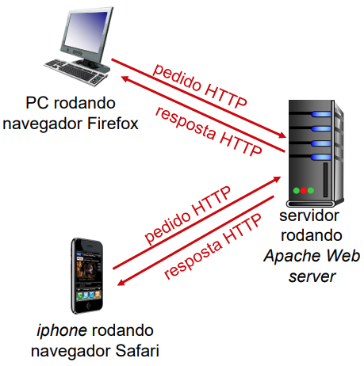

Usa TCP como protocolo da camada de transporte:
- Cliente inicia conexão TCP (cria socket) para o servidor, porta 80
- Servidor aceita conexão TCP do cliente
- Mensagens HTTP trocadas entre navegador (cliente HTTP) e servidor Web (servidor HTTP)
- Conexão TCP fechada

HTTP é “sem memória”
- Servidor não mantém informação sobre pedidos anteriores do cliente

**OBS.:** Protocolos que mantêm “memória” são complexos!
- História passada (estado) precisa ser mantido
- Se cliente/servidor cai, suas visões do “estado” podem ser inconsistentes e precisam ser reconciliadas

##### Tipos de conexão HTTP

- HTTP não persistente
    - No máximo um objeto enviado sobre uma conexão TCP
        - Conexão então fechada
    - Fazer download de múltiplos objetos requer múltiplas conexões
- HTTP persistente
    - Múltiplos objetos podem ser enviados sobre única conexão TCP entre cliente, servidor
    - Padrão para HTTP/1.1

##### HTTP não persistente
Suponha que usuário digita URL: [http://www.lcs.poli.usp.br/contato.html](http://www.lcs.poli.usp.br/contato.html)

    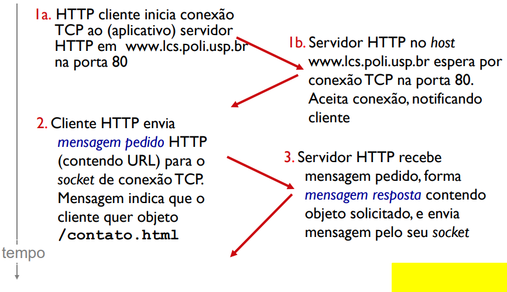

    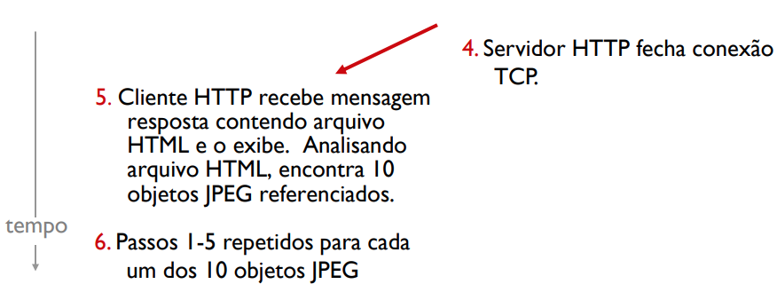

>RTT (Round-Trip Time): tempo para pequeno pacote viajar do cliente ao servidor e voltar tempo de resposta HTTP:

- 1 RTT para iniciar conexão TCP
- 1 RTT para pedido HTTP e primeiros bytes da resposta HTTP retornar
- Tempo de transmissão do arquivo
- Tempo de resposta para HTTP não persistente = 2RTT + tempo de transmissão do arquivo

    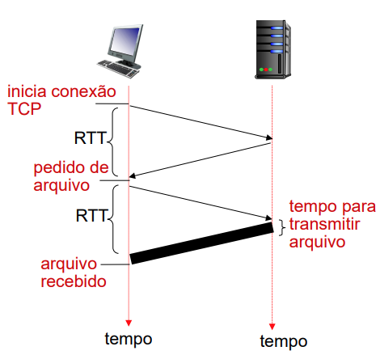

##### HTTP persistente
Problemas do HTTP não persistente :
- Requer 2 RTTs por objeto, aumentando a latência do sistema

HTTP persistente:
- Servidor deixa conexão aberta depois de enviar resposta
- Mensagens HTTP subsequentes entre mesmo cliente/servidor enviadas sobre a conexão aberta
- Cliente envia pedido assim que encontra objeto referenciado
- Perto de 1 RTT para todos os objetos referenciados

#### Mensagem pedido HTTP 1.1

- 2 tipos de mensagens HTTP: pedido (request), resposta
- Mensagem pedido HTTP:
    - ASCII (formato que permite leitura por humanos)

    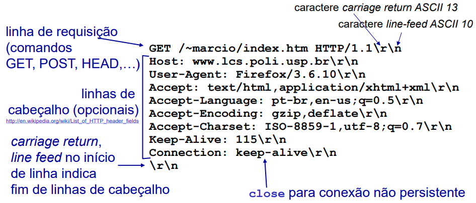

##### Mensagem pedido HTTP 1.1: Formato geral

    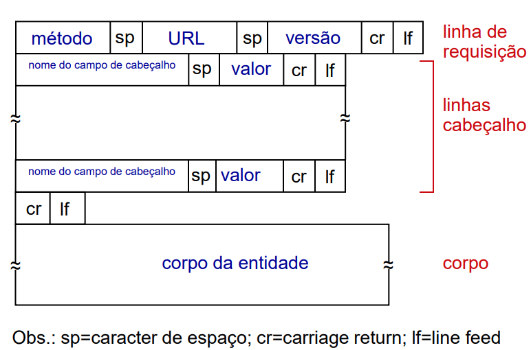

##### Mensagem resposta HTTP 1.1

    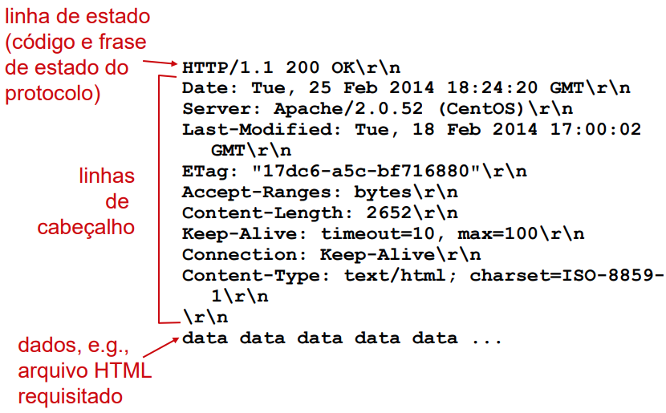

##### Códigos de estado da resposta HTTP

- Código de estado aparece na 1a linha da mensagem resposta servidor-cliente
- Alguns códigos exemplos:
    - 200 OK
        - Atendido com sucesso, objeto pedido mais para frente na msg
    - 301 Moved Permanently
        -  Objeto pedido foi movido, nova localização especificada mais a frente nessa msg (Location:)
    - 400 Bad Request
        - Mensagem pedido não entendida pelo servidor
    - 404 Not Found
        - Documento pedido não encontrado nesse servidor
    - 505 HTTP Version Not Supported

##### Experimentando o HTTP 1.1 (lado cliente)

Usando o Wireshark:

1. Abra o navegador
2. Abra o Wireshark e inicialize a varredura de pacotes no enlace usado para acesso à rede (e.g., WiFi)
3. Acesse pelo navegador o endereço [http://nginx.org/](http://nginx.org/)
4. Siga (‘follow’ no Wireshark) a troca HTTP para este pedido

    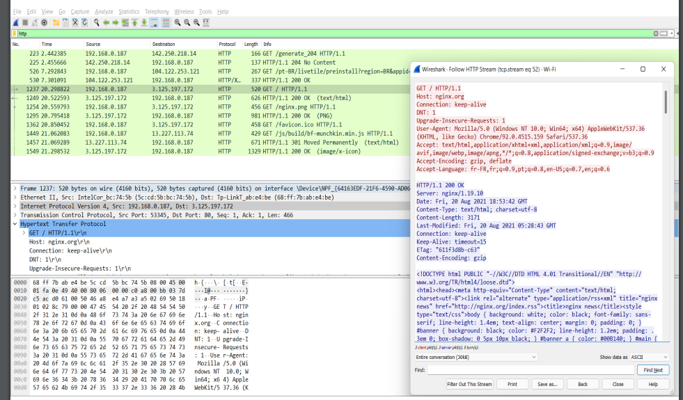

**OBS - HTTPS**

- O HTTPS (Hyper Text Transfer Protocol Secure - protocolo de transferência de hipertexto seguro) é uma implementação do protocolo HTTP que tem se tornado o padrão na web.
- Possui uma camada adicional de segurança que utiliza o protocolo SSL/TLS.
- Essa camada adicional permite que os dados sejam transmitidos por meio de uma conexão criptografada e que se verifique a autenticidade do servidor e do cliente por meio de certificados digitais. Passou a ser o padrão a partir do HTTP/2.
- A porta usada para o protocolo HTTPS é a 443.

**OBS - HTTP/3 e QUIC**

- Diferentemente das versões anteriores, o HTTP/3 não é baseado no TCP mas sim no [QUIC](https://en.wikipedia.org/wiki/QUIC) ([RFC 9000](https://datatracker.ietf.org/doc/html/rfc9000)), desenvolvido inicialmente pelo Google.
- Em 2025, cerca de [33% do tráfego HTTP já é realizado sobre o QUIC](https://radar.cloudflare.com/adoption-and-usage#http-version). A principal vantagem é a diminuição significativa do tempo de resposta.
- Nesta disciplina, tomamos por base a versão 1.1 do HTTP por questões didáticas. Dessa forma, fica mais fácil se concentrar nos princípios da camada de aplicação, deixando o problema da comunicação confiável para a camada de transporte que será vista a partir da próxima aula.
- Um vídeo inicial sobre as diferenças do HTTP/3 em relação às versões anteriores pode ser visto [aqui](https://youtu.be/cdb7M37o9sU).
- Mais detalhes sobre o HTTP/3 e o QUIC são deixados para cursos mais avançados.

**Exercício do Kurose (p. 125)**

Considere o seguinte string de caracteres ASCII que foram capturados pelo Wireshark quando o navegador enviou uma mensagem HTTP GET. Os caracteres
`<cr><lf>` são caracteres carriage return e line-feed . Responda as seguintes questões,
indicando onde na mensagem HTTP GET abaixo você encontra a sua resposta.

    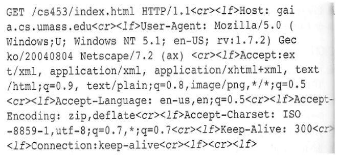

a) Qual o URL do documento requisitado pelo navegador?

b) Qual a versão de HTTP o navegador está rodando?

c) O navegador requisitou uma conexão persistente ou não persistente?

d) Qual é o endereço IP do host no qual o navegador está rodando?

e) Que tipo de navegador iniciou a mensagem? Por que é necessário o tipo de navegador numa mensagem de pedido HTTP?

### Princípios da transferência confiável de dados (recorte da camada de transporte)
...

### Camada de rede
...

## Transporte
<!-- 2.2. Camada de transporte: Princípios da transferência confiável de dados -->
...

## Rede
Referência:
- Parte 1: (Kurose, Seção 4.1)
- Parte 2: (Kurose, Seções 1.4 e 4.2)

### Introdução à camada de rede
Sobre a camada de rede:
- Transporta segmentos do host fonte para o host destino
- No lado transmissor encapsula segmentos em datagramas
- No lado receptor, entrega segmentos para camada de transporte
- Protocolos da camada de rede em todo host e roteador
- Roteador examina campos de cabeçalho em todos os datagramas que passam por ele

#### Duas funções-chave da camada de rede
- Repasse (forwarding)
    - mover pacotes da entrada do roteador para saída apropriada (local)
    - Hardware – escala de nanosegundos
- Roteamento (routing)
    - determinar rota tomada por pacotes da fonte ao destino (global)
    - Software – escala de segundos
    - Algoritmos de roteamento (fica para o 4º ano)

Uma analogia para entender essas duas funções:
- Roteamento: processo de planejar viagem da origem ao destino
- Repasse: processo de passar por uma única encruzilhada

    

#### Plano de dados e plano de controle
**Plano de Dados**:
- Função local executada por cada roteador
- Determina como um datagrama chegando por uma porta de entrada do roteador é repassado para uma porta de saída
- Função de repasse (basicamente)

**Plano de Controle**:
- Lógica para rede inteira
- Determina como datagrama são repassados entre roteadores ao longo do caminho fim-a-fim do host fonte até o host destino
- 2 abordagens para plano de controle:
    - Algoritmos de roteamento tradicionais: implementados nos roteadores
    - Software-Defined Networking (SDN): implementados em servidores (remotos)

### Dentro de um roteador
#### Arquitetura básica de um roteador
Duas funções chaves do roteador:
- Rodar protocolos e algoritmos de roteamento
- Repassar ou comutar datagramas de enlace de entrada para enlace de saída

    

Link de vídeo explicativo: [o que há dentro de um roteador/switch/ ponto
de acesso Wifi doméstico](https://www.youtube.com/watch?v=q_8dpXrEwZI)

#### Tabela de repasse: ideia inicial
...

**Casamento de prefixo mais longo**: Quando busca-se entrada de tabela de repasse para dado endereço de destino, usa-se prefixo de endereço mais longo que casa com endereço desejado.

#### Funções da porta de entrada
...

...

#### Mecanismos de agendamento
- Agendamento FIFO
- Agendamento por prioridade
- Round robin ("rodízio")
- Weighted Fair Queuing (WFQ)

#### Transbordamento
- Pode haver também transbordamento do buffer da porta de saída.
- Política de qual pacote descartar é chamada de administração ativa de fila.
- Exemplos:
    - Tail drop: elimina pacote chegando
    - Prioridade: elimina/remove pacote baseado em prioridade
    - Aleatório: elimina/remove aleatoriamente

#### Neutralidade da rede

O que é a neutralidade da rede?
- Técnica: como uma rede de acesso deve alocar e compartilhar seus recursos
    - Mecanismos: agendamento de pacotes, administração ativa de filas
- Princípios sociais, econômicos e políticos.
    - Proteção à liberdade de expressão
    - Encorajamento da inovação e competição
- Implementada via políticas públicas, normas técnicas e leis.

Países diferentes usam abordagens diferentes para a neutralidade da rede.

A neutralidade da rede é regulada no Brasil com o Marco Civil da Internet, Lei n. º 12.965/2014, sancionada em 2014 e regulamentada em 2016.

> Seção I: Da neutralidade da rede ([Lei n. º 12.965/2014](https://www.planalto.gov.br/ccivil_03/_ato2011-2014/2014/lei/l12965.htm))
>> O responsável pela transmissão, comutação ou roteamento tem o dever de tratar de forma isonômica quaisquer pacotes de dados, sem distinção por conteúdo, origem e destino, serviço, terminal ou aplicação.

### Atrasos e vazão
Comutação de pacotes: store-and-forward

- Leva $L/R$ segundos para transmitir (inserir) pacote de $L$ bits em um enlace a $R$ bits/s
- *Store and forward* (adotado em geral em roteadores): pacote inteiro precisa chegar no roteador antes que possa ser transmitido ao próximo enlace

No exemplo abaixo, atraso fim-fim para 1 pacote = 2L/R (assumindo zero atraso de propagação)

    

#### Fontes de atraso de pacotes

    

- $d_{proc}$: processamento no nó
    - Detecção de erros em bits
    - Determinação do enlace de saída
    - De nano a microssegundos
- $d_{fila}$: atraso de fila
    - Tempo esperando no enlace de saída para transmissão
    - Depende do nível de congestionamento no roteador
    - De micro a milissegundos
- $d_{trans}$: atraso de transmissão
    - de nano a milissegundos
    - $L$: comp. do pacote (bits)
    - $R$: capacidade do enlace (bits/s)
    - $d_{trans} = L/R$
- $d_{prop}$: atraso de propagação
    - milisegundos (WAN)
    - $s$: comprimento do enlace físico
    - $v$: vel. de propagação no meio (~2x108 m/s)
    - $d_{prop} = s/v$

Avaliando atrasos de transmissão e de propagação:
- Enlace longos e taxas de transmissão (R) altas – dprop predomina
- Enlace curtos e taxas de transmissão (R) baixas – dtrans predomina
- Em muitos casos, uma delas é bem mais importante que a outra

...

#### Vazão (*throughput*)

- Vazão: taxa (bits/s) em que bits são transferidos entre fonte/destino
    - Instantânea: taxa num certo instante de tempo
    - Média: taxa média sobre um período de tempo

    

...

No cenário internet:

    

10 conexões partilham conexões (de forma justa) no enlace gargalo backbone R bits/s

- Vazão por conexão: $min(R_c,R_s,R/10)$
- Na prática: $R_c$ or $R_s$ é geralmente o gargalo

### Endereçamento IP
...

### Repasse generalizado e SDN
...
