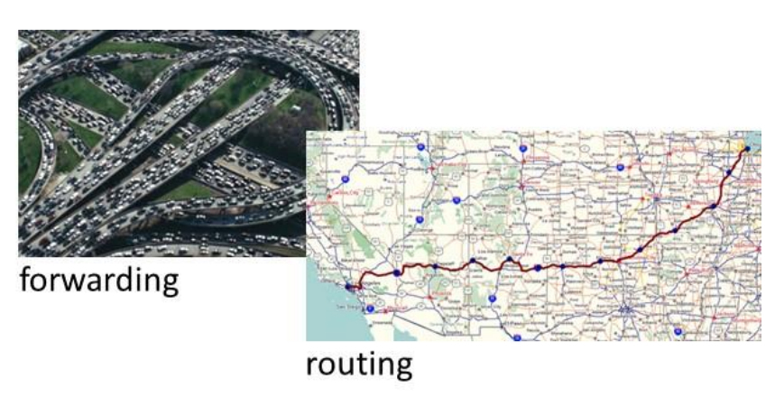
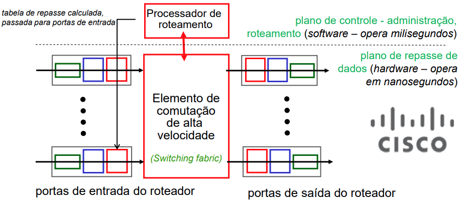
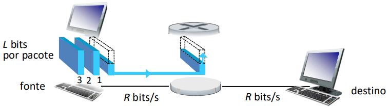
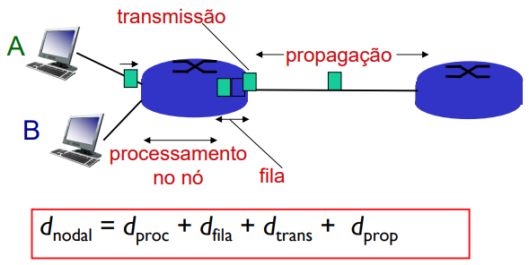
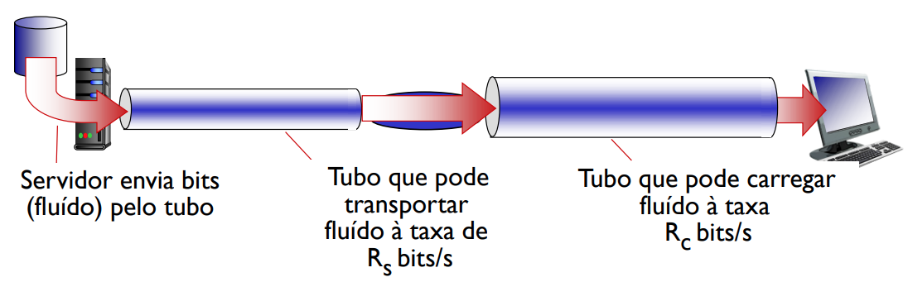
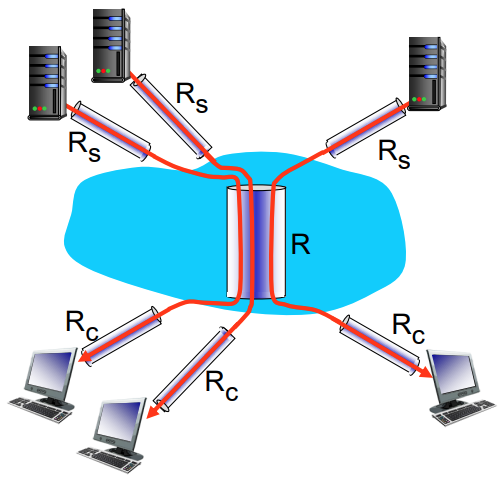

<!--PARTE 2-->
<!--
2. Introdução às camadas superiores (7 aulas)
2.1. Camada de aplicação
2.2. Camada de transporte: Princípios da transferência confiável de dados
2.3. Camada de rede: endereçamento IP e como funciona um roteador
-->
# Parte 2 - Camadas superiores

## Aplicação
...

## Transporte
...

## Rede
Referência:
- Parte 1: (Kurose, Seção 4.1)
- Parte 2: (Kurose, Seções 1.4 e 4.2)

### Introdução à camada de rede
Sobre a camada de rede:
- Transporta segmentos do host fonte para o host destino
- No lado transmissor encapsula segmentos em datagramas
- No lado receptor, entrega segmentos para camada de transporte
- Protocolos da camada de rede em todo host e roteador
- Roteador examina campos de cabeçalho em todos os datagramas que passam por ele

#### Duas funções-chave da camada de rede
- Repasse (forwarding)
    - mover pacotes da entrada do roteador para saída apropriada (local)
    - Hardware – escala de nanosegundos
- Roteamento (routing)
    - determinar rota tomada por pacotes da fonte ao destino (global)
    - Software – escala de segundos
    - Algoritmos de roteamento (fica para o 4º ano)

Uma analogia para entender essas duas funções:
- Roteamento: processo de planejar viagem da origem ao destino
- Repasse: processo de passar por uma única encruzilhada

    

#### Plano de dados e plano de controle
**Plano de Dados**:
- Função local executada por cada roteador
- Determina como um datagrama chegando por uma porta de entrada do roteador é repassado para uma porta de saída
- Função de repasse (basicamente)

**Plano de Controle**:
- Lógica para rede inteira
- Determina como datagrama são repassados entre roteadores ao longo do caminho fim-a-fim do host fonte até o host destino
- 2 abordagens para plano de controle:
    - Algoritmos de roteamento tradicionais: implementados nos roteadores
    - Software-Defined Networking (SDN): implementados em servidores (remotos)

### Dentro de um roteador
#### Arquitetura básica de um roteador
Duas funções chaves do roteador:
- Rodar protocolos e algoritmos de roteamento
- Repassar ou comutar datagramas de enlace de entrada para enlace de saída

    

Link de vídeo explicativo: [o que há dentro de um roteador/switch/ ponto
de acesso Wifi doméstico](https://www.youtube.com/watch?v=q_8dpXrEwZI)

#### Tabela de repasse: ideia inicial
...

**Casamento de prefixo mais longo**: Quando busca-se entrada de tabela de repasse para dado endereço de destino, usa-se prefixo de endereço mais longo que casa com endereço desejado.

#### Funções da porta de entrada
...

...

#### Mecanismos de agendamento
- Agendamento FIFO
- Agendamento por prioridade
- Round robin ("rodízio")
- Weighted Fair Queuing (WFQ)

#### Transbordamento
- Pode haver também transbordamento do buffer da porta de saída.
- Política de qual pacote descartar é chamada de administração ativa de fila.
- Exemplos:
    - Tail drop: elimina pacote chegando
    - Prioridade: elimina/remove pacote baseado em prioridade
    - Aleatório: elimina/remove aleatoriamente

#### Neutralidade da rede

O que é a neutralidade da rede?
- Técnica: como uma rede de acesso deve alocar e compartilhar seus recursos
    - Mecanismos: agendamento de pacotes, administração ativa de filas
- Princípios sociais, econômicos e políticos.
    - Proteção à liberdade de expressão
    - Encorajamento da inovação e competição
- Implementada via políticas públicas, normas técnicas e leis.

Países diferentes usam abordagens diferentes para a neutralidade da rede.

A neutralidade da rede é regulada no Brasil com o Marco Civil da Internet, Lei n. º 12.965/2014, sancionada em 2014 e regulamentada em 2016.

> Seção I: Da neutralidade da rede ([Lei n. º 12.965/2014](https://www.planalto.gov.br/ccivil_03/_ato2011-2014/2014/lei/l12965.htm))
>> O responsável pela transmissão, comutação ou roteamento tem o dever de tratar de forma isonômica quaisquer pacotes de dados, sem distinção por conteúdo, origem e destino, serviço, terminal ou aplicação.

### Atrasos e vazão
Comutação de pacotes: store-and-forward

- Leva $L/R$ segundos para transmitir (inserir) pacote de $L$ bits em um enlace a $R$ bits/s
- *Store and forward* (adotado em geral em roteadores): pacote inteiro precisa chegar no roteador antes que possa ser transmitido ao próximo enlace

No exemplo abaixo, atraso fim-fim para 1 pacote = 2L/R (assumindo zero atraso de propagação)

    

#### Fontes de atraso de pacotes

    

- $d_{proc}$: processamento no nó
    - Detecção de erros em bits
    - Determinação do enlace de saída
    - De nano a microssegundos
- $d_{fila}$: atraso de fila
    - Tempo esperando no enlace de saída para transmissão
    - Depende do nível de congestionamento no roteador
    - De micro a milissegundos
- $d_{trans}$: atraso de transmissão
    - de nano a milissegundos
    - $L$: comp. do pacote (bits)
    - $R$: capacidade do enlace (bits/s)
    - $d_{trans} = L/R$
- $d_{prop}$: atraso de propagação
    - milisegundos (WAN)
    - $s$: comprimento do enlace físico
    - $v$: vel. de propagação no meio (~2x108 m/s)
    - $d_{prop} = s/v$

Avaliando atrasos de transmissão e de propagação:
- Enlace longos e taxas de transmissão (R) altas – dprop predomina
- Enlace curtos e taxas de transmissão (R) baixas – dtrans predomina
- Em muitos casos, uma delas é bem mais importante que a outra

...

#### Vazão (*throughput*)

- Vazão: taxa (bits/s) em que bits são transferidos entre fonte/destino
    - Instantânea: taxa num certo instante de tempo
    - Média: taxa média sobre um período de tempo

    

...

No cenário internet:

    

10 conexões partilham conexões (de forma justa) no enlace gargalo backbone R bits/s

- Vazão por conexão: $min(R_c,R_s,R/10)$
- Na prática: $R_c$ or $R_s$ é geralmente o gargalo

### Endereçamento IP
...

### Repasse generalizado e SDN
...
