# Parte 3 - Camadas de enlace e física

<!--
3.1 Introdução
Referência para estudo: Kurose, Seção 5.1 e notas de aula.

3.2 Controle de acesso ao canal compartilhado e endereçamento MAC

Referência para estudo: Kurose, Seções 6.3 e notas de aula.

3.3 Endereçamento MAC e switches

Referência para estudo: Kurose, Seções 6.4 e notas de aula.

3.4 Camada Física: meios de transmissão

Referência para estudo: notas de aula

3.5 Camada Física: Rádio-enlaces

Referência para estudo: Mariotto, Cap. 4, Wentworth, Cap. 8 e notas de aula.

Referência: (Kurose, Seções 1.1 e 1.2)
-->

Referências:
- Kurose, Seções 6.1 e 6.3
- Tanembaum, Seção Seção 4.2

## Introdução

A camada de enlace trata da transferência de **quadros** entre elementos vizinhos na rede. Alguns protocolos importantes dessa camada são:
- Ethernet
- 802.11 (WiFi)
- DOCSIS

### Terminologia
- Nós: dispositivos que rodam protocolos da camada de enlace (camada 2) - hosts, roteadores, switches, pontos de acesso WiFi, etc.
- Enlaces: canais de comunicação que conectam nós adjacentes ao longo do
caminho de comunicação
    - enlaces com fio
    - enlaces sem fios
    - LANs
- Quadro: pacote na camada de enlace
    - encapsula datagrama (pacote na camada de rede)

Camada de enlace de dados tem a responsabilidade de transferir datagramas de um nó a um nó fisicamente adjacente através de um enlace

### Onde a camada de enlace é implementada?

- Em cada e todos os nós
- Em hosts, camada de enlace implementada em “adaptador” (ou cartão de interface de rede NIC) ou na placa-mãe (on board)
- Exemplos: [Controlador de interface de rede Ethernet](https://en.m.wikipedia.org/wiki/Network_interface_controller) e 802.11- implementa camadas de enlace e física
- Exemplo de [datasheet](https://www.ti.com/lit/ds/symlink/dp83815.pdf)
- Afixa-se no sistema de barramentos do host
- Combinação de hardware, software, [firmware](https://pt.wikipedia.org/wiki/Firmware)

    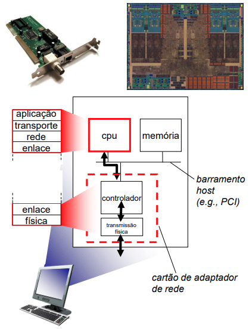

### Comunicação entre adaptadores

    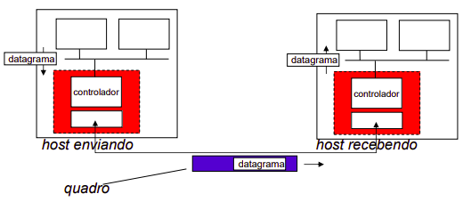

- Lado que envia:
    - Encapsula datagrama em quadro
    - Adiciona bits verificadores de erro, informações para comunicação confiável (RDT), controle de fluxo, etc.
- Lado que recebe:
    - Procura por erros, RDT, controle de fluxo, etc.
    - Extrai datagrama, passa para camada superior no lado recebendo

### Principais serviços da camada de enlace

- Enquadramento e endereçamento:
    - Encapsulamento do datagrama em quadro, adicionando cabeçalho
    - Endereços “MAC” (Medium Access Control) usados nos cabeçalhos de quadro para identificar fonte e destino
- Detecção e correção de erro:
    - Erros causados por atenuação do sinal, ruído, interferências.
    - Receptor detecta presença de erros e pode tomar várias possíveis providências:
        - Simplesmente descarta quadro
        - Descarta quadro e solicita retransmissão
        - Corrige erro(s) em bit(s) sem necessitar de retransmissão
- Acesso compartilhado ao enlace:
    - Regras para acesso ao canal se o meio é compartilhado

## Controle de acesso ao canal compartilhado

### Enlaces de acesso múltiplo e protocolos
2 tipos de enlace:
- Ponto-a-ponto:
    - PPP para acesso discado (dial up)
    - Enlace ponto-a-ponto entre switch ethernet e host
- De difusão ou broadcast (meio compartilhado):
    - Ethernet com barramento
    - Upstream do DOCSIS (Internet por empresa de TV a cabo)
    - LAN sem fio 802.11 (Wifi)

    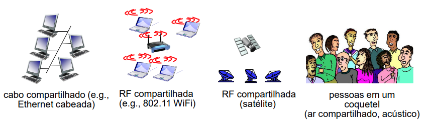

#### Protocolos de Acesso Múltiplo (MAC)

- Canal de broadcast compartilhado entre os nós
- Havendo 2 ou mais transmissões simultâneas de nós: interferência
    - Colisão se nó recebe 2 ou mais quadros ao mesmo tempo
        - Em geral, o nó recebendo não consegue entender nenhum dos dois quadros: perdidos!
        - Canal desperdiçado durante transmissão dos quadros
Protocolo de acesso múltiplo
- Algoritmo distribuído que determina como nós compartilham canal, i.e., determina quando cada nó transmite
- Assunto de Telecom estudado a mais de 45 anos para
comunicações digitais e com muita atividade ainda!
- Note que a comunicação sobre compartilhamento do canal precisa
usar canal também
    - não há canal out-of-band para coordenação

##### Um protocolo de acesso múltiplo ideal

Dado: canal de difusão broadcast com taxa R bits/s por nó

Solução ideal:

    1. Quando apenas 1 nó quer transmitir, consegue fazê-lo à taxa $R$
    2. Quando $M$ nós querem transmitir, cada um pode transmitir à taxa média de $R/M$
    3. Totalmente descentralizado:
        - Não há nó especial para coordenar transmissões
        - Não há sincronização de relógios, intervalos
    4. Simples e barato de implementar

#### Protocolos MAC (Medium Access Control): Taxonomia

Há 3 grandes categorias:
- Particionamento de canal
    - Divide canal em “pedaços” menores (intervalos de tempo, frequência, código)
    - Aloca pedaços para nós para uso exclusivo
    - Exemplos: TDMA, FDMA
    - Telefonia fixa e celular convencional, TV, rádio

- Acesso aleatório
    - Canal não dividido, permite colisões
    - “Recupera-se” de colisões
    - Wi-fi, DOCSIS

- Revezamento
    - Nós revezam-se na transmissão
    - Bluetooth 

Ex.: Técnicas MAC e implementações práticas

    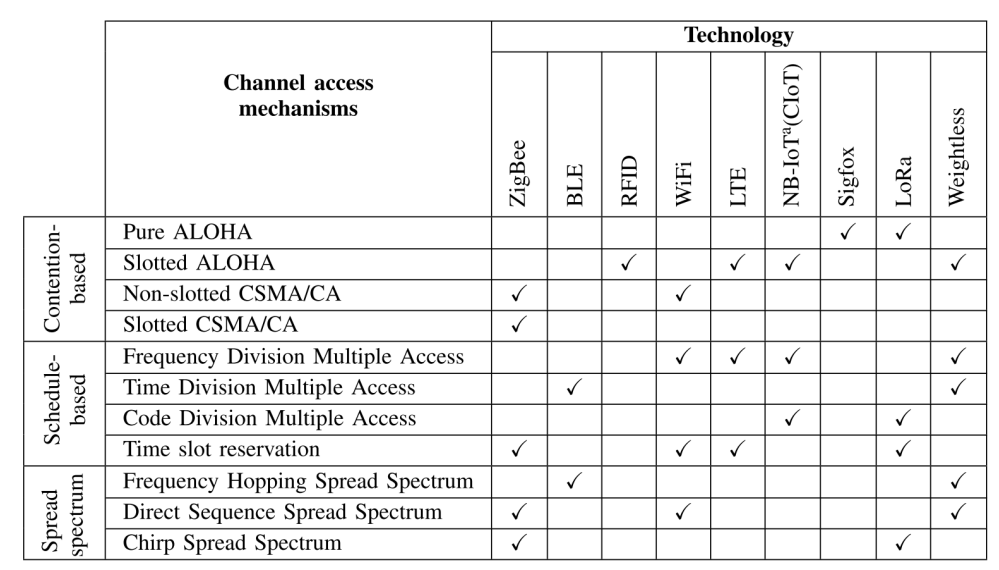

Retirado de [A. Laya et al., “Goodbye, ALOHA”, IEEE Access, 2016](./extra/Goodbye_ALOHA.pdf)

**Obs.:**
- BLE – [Bluetooth Low Energy](https://en.wikipedia.org/wiki/Bluetooth_Low_Energy);
- ZigBee – versão mais avançada do [IEEE 802.15.4](https://en.wikipedia.org/wiki/IEEE_802.15.4);
- [LoRa](https://www.link-labs.com/asset-tracking) – Long Range for low-power (LP) WAN;
- [Sigfox](https://sigfox.com/) – outro Sistema para LPWAN;
- [Weightless](https://en.wikipedia.org/wiki/Weightless_(wireless_communications)) – mais um padrão para IoT

### Particionamento de canal

#### Protocolos MAC por particionamento de canal: TDMA e FDMA

TDMA: Time Division Multiple Access
- Acesso ao canal em “turnos"
- Cada nó obtém intervalo (slot) de tempo de duração fixa (duração é o tempo de transmissão de 1 pacote) a cada turno (quadro)
- Slots não usados ficam desocupados
- Exemplo: LAN com 6 nós, 1,3,4 têm pacotes, slots 2,5,6
desocupados

    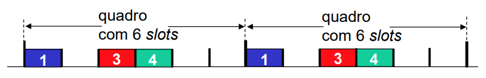

FDMA: Frequency Division Multiple Access
- Espectro do canal dividido em faixas de frequências
- A cada nó é designado uma faixa de frequência
- Faixas de frequência em que não ocorre transmissão ficam desocupadas
- Exemplo: LAN com 6 nós, 1,3,4 têm pacotes, faixas de frequência 2,5,6 desocupadas

    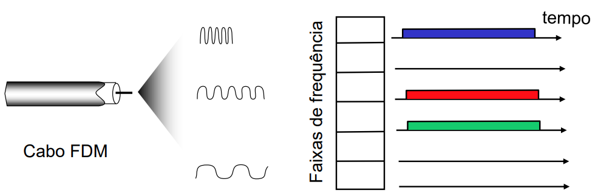

#### Conclusões do TDMA e FDMA

- Quando $M$ nós estão ativos, conseguem transmitir à taxa $R/M$
    - Interessante, por exemplo, para transmissão de estações de rádio e televisão
- Quando apenas 1 nó está ativo, transmite à taxa $R/M$
    - Desperdício de recurso no caso em que os nós transmitem em rajadas ficando muito tempo inativos, caso usual das redes de dados
- Necessário controle central
- Não é razoável para redes de dispositivos computacionais. Solução
alternativa: acesso aleatório

### Acesso aleatório

- Quando nó tem pacote para enviar
    - Transmite à taxa total do canal R bits/s.
    - Não há coordenação a priori entre nós.
- 2 ou mais nós transmitindo ➜ “colisão”!!
- Protocolo MAC de acesso aleatório especifica:
    - Como detectar colisões
    - Como se recuperar de colisões (por exemplo, via retransmissões atrasadas)
- Exemplos de protocolos MAC de acesso aleatório:
    - Slotted ALOHA
    - ALOHA
    - Carrier Sense Multiple Access (CSMA), CSMA/CD, CSMA/CA

#### Slotted ALOHA
- Criado por [Norman Abramson](https://en.wikipedia.org/wiki/Norman_Abramson) em 1969 no Hawaii
    - ALOHA: Additive Links On-line Hawaii Area
- Foi insipiração inicial para CSMA do Ethernet e Wi-Fi

Hipóteses:
- Todos os quadros têm mesmo comprimento $L$ bits
- Tempo dividido em slots de $L/R$ segundos (tempo para transmitir 1 quadro)
- Nós começam a transmitir apenas no início do slot
- Nós são sincronizados
- Se 2 ou mais nós transmitem em mesmo slot, todos os nós são avisados da colisão

Operação:
- Quando chega novo quadro, nó transmite no próximo slot
- Se houve colisão: nó tenta retransmitir quadro após um número aleatório de slots
- Se houve transmissão e não há colisão: ok!

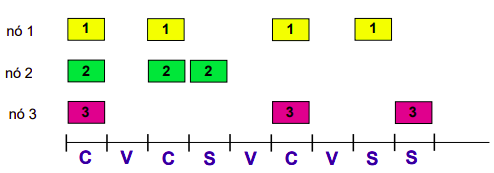

Prós:
- Se houver um único nó ativo,
ele transmite continuamente
na taxa total do canal
- Altamente descentralizado:
apenas slots nos nós
precisam ser sincronizados
- Simples

Contras:
- Colisões, slots perdidos
- Slots desocupados
- Colisões poderiam ser detectadas em menos tempo do que o necessário para transmitir pacotes
- Sincronização de relógio

##### **Eficiência**

É a fração dos slots bem sucedidos.

> Tráfego ofertado ($G$):  Número médio de tentativas de transmissão ou retransmissões em um dado instante

Suponha que $N$ nós geram um tráfego $G\leq N$, que é originado das transmissões ou retransmissões que ocorrem com probabilidade $p = G/N$ por nó.

Probabilidade de que dado nó tenha sucesso em um slot = $p(1-p)^{N-1}$

Probabilidade de que qualquer nó
tenha sucesso:
$$
E = Np(1-p)^{N-1} = G\left(1 - \dfrac{G}{N}\right)^{N-1}
$$

1) Mostrar que a eficiência máxima do slotted ALOHA é

$$
E_{max} = \left( 1 - \dfrac{1}{N} \right)^{N-1}
$$
e ocorre para $G = 1$.

Solução: Derivada nula de E em relação a G (ponto crítico):

$$
\dfrac{\partial E}{\partial G} = 0
$$

$$
\dfrac{\partial}{\partial G} \left(G\left(1 - \dfrac{G}{N}\right)^{N-1}\right)= 0
$$

$$
\left(1 - \dfrac{G}{N}\right)^{N-1} + (1-N)\dfrac{G}{N}\cdot\left(1 - \dfrac{G}{N}\right) = 0
$$

2) Mostrar que 
$$
\lim_{N \to \infty} = E_{max} = \dfrac{1}{e}
$$

 

    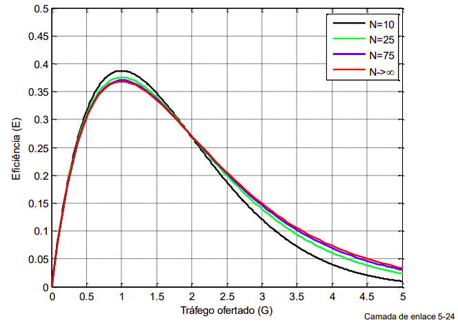

    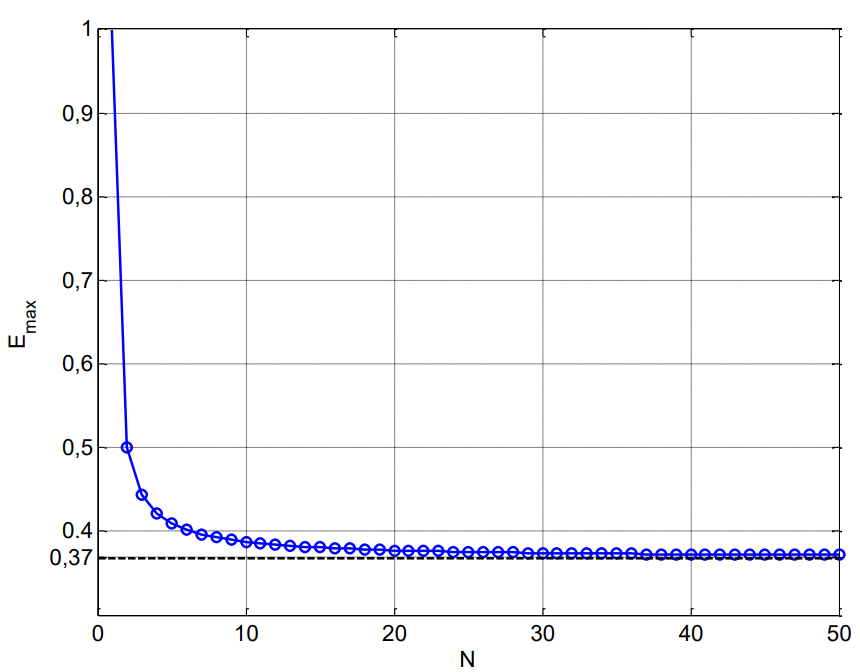

##### Slotted ALOHA e TCP

Com $G \approx 1$, quadros podem levar bastante tempo para chegar no receptor, devido às colisões e consequente retransmissões. 

**Exercício:** isso faz com que pacotes TCP encapsulados no quadros acabem sendo reenviados pela camada de transporte devido a timeout?

#### ALOHA puro

- ALOHA sem slots: mais antigo (proposta original do artigo de 1969), mais simples, sem sincronização
- Quando quadro chega
    - Tenta transmitir imediatamente
    - Se houver colisão aguarda um tempo aleatório para retransmitir
- Na análise vamos assumir novamente que são N nós, quadros de mesmo comprimento
- Probabilidade de colisão aumenta:
    - quadro enviado em $t_0$ colide com outros quadros enviados em $(t_0-1,t_0+1)$ (duração do quadro é uma unidade de tempo)

    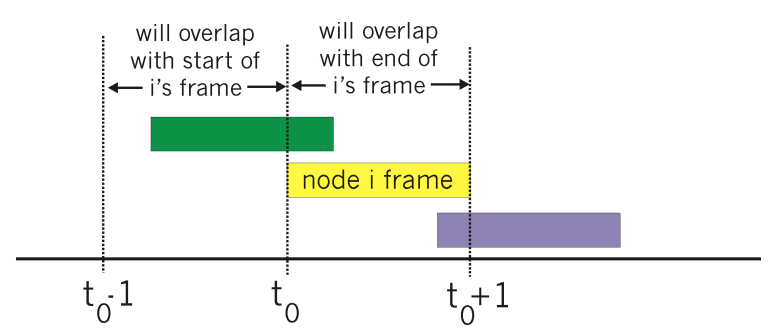

##### Eficiência do ALOHA Puro

A probabilidade de sucesso para um dado nó depende da transmissão dele e de nenhum outro nó transmitir nem antes nem depois.

    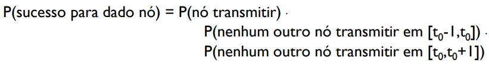

$$ \text{P(sucesso dado nó)} = p\cdot(1-p)^{N-1}\cdot (1-p)^{N-1} $$
$$ \text{P(sucesso dado nó)} = p\cdot(1-p)^{2(N-1)} $$
$$\therefore
\text{P(sucesso para qualquer nó)} = Np\cdot(1-p)^{2(N-1)}
$$

Dessa forma: $E = G\left(1 - \dfrac{G}{N} \right)^{2(N-1)}$

Exercícios:

1) Mostrar que a eficiência máxima a o ALOHA puro é
$$
E_{max} = \left( \dfrac{N}{2N-1} \right)\left( 1 - \dfrac{1}{2N-1} \right)^{2(N-1)}
$$
e ocorre para $G = G_0 = \dfrac{N}{2N−1}$

2) Mostrar que $\lim_{N\to\infty} E_{max} = \dfrac{1}{2e}$

    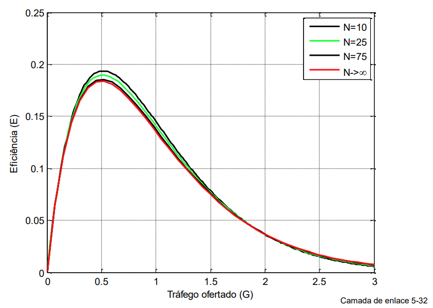

    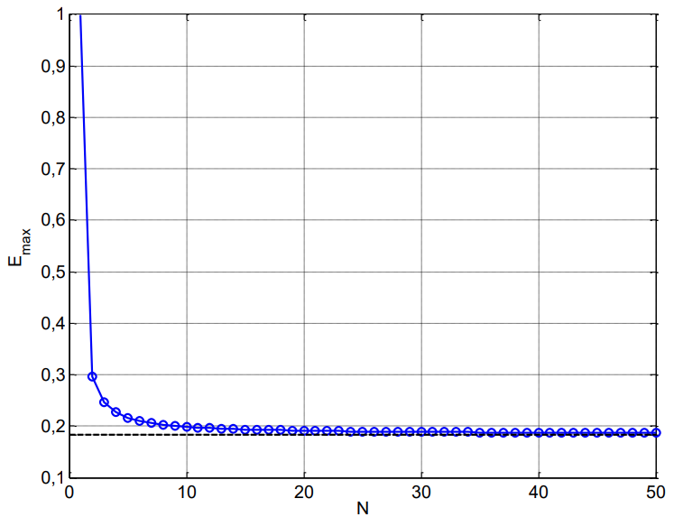

##### Exercício extra

Suponha que quatro nós ativos (nós A, B, C e D) estejam competindo pelo acesso a um canal usando o *slotted* ALOHA. Cada nó tenta transmitir em cada intervalo (*slot*) com probabilidade $p$. O primeiro é numerado como 1, o segundo como 2 e assim por diante.

a) Qual a probabilidade de que o nó A tenha sucesso pela primeira vez no intervalo 5?

b) Qual a probabilidade de que algum nó (A, B, C ou D) tenha sucesso no intervalo 4?

c) Qual a probabilidade de que o primeiro sucesso ocorra no intervalo 3?

d) Qual a eficiência nesse sistema de 4 nós?

% 

% 

Minha solução:

a)
....

Resposta: $(1-p(1-p)^3)^4p(1-p)^3$

b)
....

Resposta: $4p(1-p)^3$

c)
....

Resposta: $(1-4p(1-p)^3)^24p(1-p)^3$

d)
....

Resposta: $4p(1-p)^3$

#### CSMA

- Sigla para Carrier Sense Multiple Access.
- O nó “escuta” canal antes de transmitir

Ideia básica:
- se detecta que o canal está livre: transmitir quadro inteiro
- se detecta que canal está ocupado, adia transmissão

- Analogia humana:
    - ALOHA: Começar a falar independentemente de outros estarem falando
    - CSMA:
        - Escute antes de falar – se alguém está falando, espere ele terminar
            - Collision Avoidance (CSMA puro ou CSMA-CA)
            - Exemplos: Wi-Fi e outros enlaces sem fio
        - Se, além disso, alguém começar a falar ao mesmo tempo – pare de falar
            - Collision Detection (CSMA-CD)
            - Exemplos: Ethernet e outros enlaces cabeados

##### CSMA-CA (Collision Avoidance)
- Colisões ainda podem ocorrer: atraso de propagação faz com que 2 nós possam não escutar a transmissão um do outro no momento de começar a transmitir
- Colisão: tempo de transmissão de pacote inteiro é perdido
    - Distância e atraso de propagação desempenham papel na determinação da probabilidade de colisão

##### CSMA-CD (Collision Detection)
- Monitoração de portadora, adiamento como no CSMA
    - Colisões detectadas em curto tempo
    - Transmissões colidindo abortadas, reduzindo desperdício de canal

- Detecção de colisão:
    - Fácil em LANs cabeadas: medir intensidade dos sinais, comparar sinais transmitido e recebido
    - Difícil em LANs sem fio: intensidade do sinal recebido dominada pela intensidade da transmissão local
- Analogia humana : o conversador educado

    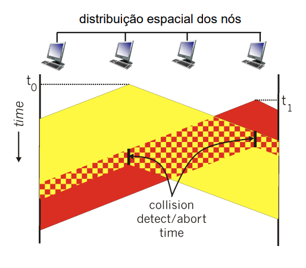

###### Eficiência do CSMA-CD

Segue os parâmetros:
    - $d_{prop}$ = máximo atraso de propagação entre 2 nós na LAN
    - $d_{trans}$ = tempo para transmitir quadro de máximo comprimento (aprox. 1,2 ms para uma Ethernet a 10 Mbps)

$$
E_{max} = \dfrac{1}{1 + 5\dfrac{d_{prop}}{d_{trans}}}
$$

- Melhor desempenho do que ALOHA em condição de tráfego
elevado.

Exercício: Mostre que 

$$ \lim_{d_{prop}\to 0} E_{max} = 1 $$
ou
$$ \lim_{d_{trans}\to \infty} E_{max} = 1 $$
Explique porquê isso faz sentido.

**Minha solução:**

Só aplicar o limite de uma fração com denominador tendendo a infinito ou do numerador tendendo a 0, que aquela razão entre os atrasos vira 0, de forma que a eficiência máxima tende a 1.

#### Exemplos: Ethernet e Wi-Fi

##### Exemplo 1: Algoritmo CSMA-CD do Ethernet
1. Camada de enlace recebe datagrama da camada de rede, cria quadro
2. Se detecta canal livre, inicia transmissão do quadro. Se detecta canal ocupado, espera até canal livre e então transmite.
3. Se transmite quadro inteiro sem detectar outra transmissão, missão cumprida!
4. Se detecta uma outra transmissão enquanto transmite, aborta e envia sinal de congestionamento
5. Depois de abortar, entra em backoff exponencial binário:
    - depois da m-ésima colisão, escolhe $K$ aleatoriamente de $\{0,1,2, …, 2m-1\}$. Espera $K \times 512$ tempos de bit e retorna para Passo 2
    - intervalo de backoff mais longo com mais colisões

##### Exemplo 2: Algoritmo CSMA-CD do WiFi
- Tenta-se evitar colisões: 2 ou mais nós transmitindo ao mesmo tempo
- Wi-Fi: não há detecção de colisão!
    - Difícil detectar colisões quando transmitindo devido à potência baixa dos sinais recebidos
    - De qualquer forma, não é possível detectar todas as colisões devido ao problema de terminal escondido e ao desvanecimento
    - Objetivo: evitar colisões: CA $\rarr$ Collision Avoidance

    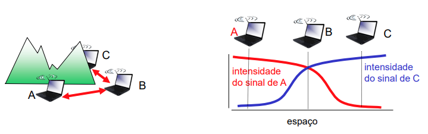

### Revezamento

#### Protocolos MAC por revezamento
- Protocolos MAC por particionamento de canal
    - Compartilha canal eficientemente de forma justa quando há altas cargas
    - Ineficiente com baixas cargas: atraso no acesso ao canal, alocado $1/N$ da capacidade do canal mesmo que somente 1 nó ativo!
- Protocolos MAC por acesso aleatório
    - Eficiente com baixas cargas: nó único pode usar a capacidade inteira do canal
    - Altas cargas: *overhead* de colisões
- Protocolos de revezamento
    - Procura pelo melhor dos 2 mundos!
    - Muitas propostas. Vamos exemplificar duas:
        - Protocolos de seleção (polling)
        - Protocolos de passagem de permissão (token)

##### Protocolos de seleção (polling)

- Nó mestre “convida” nós escravos a transmitir em turnos
- Tipicamente usados com dispositivos escravos “burros”
- Problemas:
    - Overhead de seleção
    - Latência
    - Ponto de falha único (mestre)
    - Usado no Bluetooth

    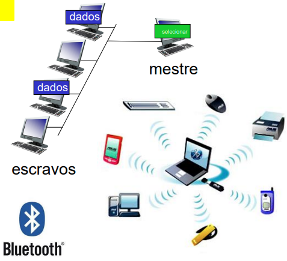

##### Passagem de permissão (token)

- Token de controle passado de 1 nó para o seguinte sequencialmente.
- Mensagem token
- Problemas:
    - *Overhead* do token
    - Latência
    - Ponto único de falha (token)
    - Usado no IEEE 802.5 (Token Ring) e FDDI (Fiber Distributed Data Interface)

    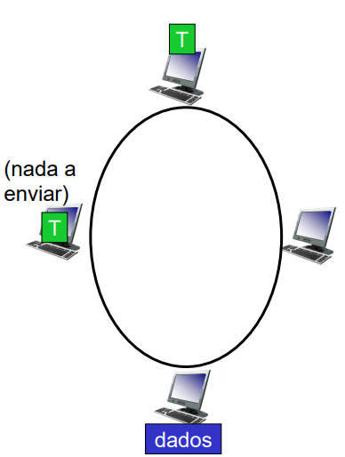

## Endereçamento MAC e *switches*
SERÁ COBRADO NA P2

<!--
## Camada física: meios de transmissão
...

## Rádio enlaces
...

-->

## Links extras:
- [The ALOHANET - Surfing for Wireless Data - História do ALOHA pelo seu inventor](./extra/THE-ALOHANET-—-SURFING-FOR-WIRELESS-DATA.pdf)

